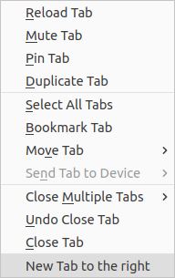
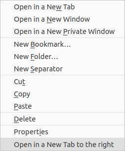

#  DreTab

[](https://addons.mozilla.org/firefox/addon/dretab/)
[](./LICENSE)

Extension for adding Chromium's "New Tab to the right" to Gecko/Firefox


## Screenshots





## Source Code generation

This proyect is build with [TypeScript](https://www.typescriptlang.org/) and using [Firefox's WebExtension Types](https://www.npmjs.com/package/@types/firefox-webext-browser).

If you want to generate the compiled JavaScript to **check the validity** of the code the extension uses in production, or with intention of **contributing** to this addon, simply follow these steps:

1. Clone this repo
```
git clone https://github.com/thedaviddelta/dretab
```
2. Install the Development Dependencies specified in the lockfile
```
yarn
```
```
npm i
```
3. Run the TypeScript Compiler
```
yarn tsc
```
```
npx tsc
```


## Contact

You can report any bug you find or suggest any feature using the [GitHub Issues](https://github.com/thedaviddelta/dretab/issues) page, or contact me about anything related to this app on info@thedaviddelta.com.


## License

[](https://www.gnu.org/licenses/gpl-3.0.html)

Copyright © 2021 [thedaviddelta](https://github.com/thedaviddelta)  
This project is [GNU GPLv3](./LICENSE) licensed
